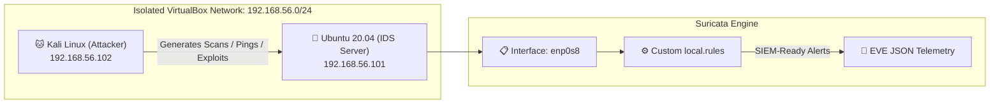

<div align="center">

# 🛡️ IDS Threat Detection Lab - Suricata

  <p align="center">
    Hands-on network security sandbox demonstrating real-time threat detection and security telemetry generation.
  </p>

[](https://suricata.io)
[](https://virtualbox.org)
[](https://github.com)
[](https://opensource.org)

---
</div>

## 🌐 Lab Architecture

To better visualize how the attack machine triggers the IDS, the lab utilizes an isolated virtual network mapping malicious activity directly into Suricata's ingestion engine:



## 📝 Overview


# IDS Threat Detection Lab - Suricata

## Overview
Hands-on Suricata IDS lab demonstrating real-time threat detection and network packet capture on an isolated home network.

## Lab Architecture
- **IDS Server:** Ubuntu 20.04 (192.168.56.101) - Suricata 7.0.10
- **Attack Machine:** Kali Linux (192.168.56.102)
- **Network:** VirtualBox Host-Only (192.168.56.0/24)

## Detection Rules (Custom)
1. ICMP Ping Detection (SID: 1000001)
2. Port Scan Detection (SID: 1000002)
3. SSH Connection Attempt (SID: 1000003)
4. HTTP Connection (SID: 1000004)

## Quick Start
```bash
sudo suricata -c /etc/suricata/suricata.yaml -i enp0s8 -l /var/log/suricata -v

Test Result
✅ All attacks detected in real-time
✅ EVE JSON alerts captured successfully
✅ Zero false positives in lab environment
• Suricata-config/suricata.yaml-Suricata configuration
• Suricata-rules/local.rules-Custom detection rules
• detection-logs/eve.json-Captured network events

Skills Demonstrated
✔️ IDS/IPS configuration and deployment
✔️ Detection rule creation (Snort syntax)
✔️ Real-time threat monitoring
✔️ Network packet analysis
✔️ EVE JSON alert format (SIEM-ready)


## 🔮 Next-Gen Expansion: SIEM Integration
Because this lab captures all events in the standard `eve.json` format, the logical next step is SIEM forwarding. 
* To see how to correlate these alerts with authentication anomalies, check out my companion lab: [Splunk SSH Brute-Force Detection Lab](https://github.com).


This lab demonstrates hands-on understanding of threat detection workflows and the detection layer of SOC operations.
